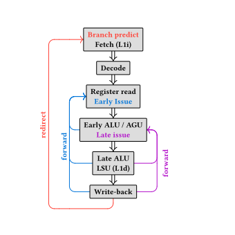
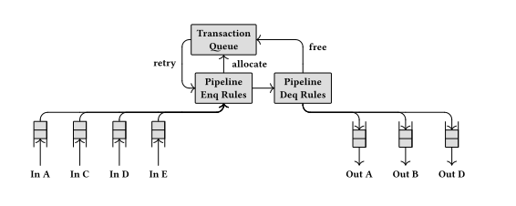

# Superscalar

A superscalar RISC-V CPU implementing rv32ima_zicsr_zba_zbb supporting cache coherency.

# Current state

## Supported features

- RV32-I
- Superscalar execution: the number of ways must be a power of two, in practice 1 or 2 gives the
    best results; beyond that, the results are less interesting compared to the gain in surface
    area/loss of frequency. It use a xor-based multi-ported register file.
- Forwarding from the ALUs/LSU to the register read stage
- Multiplication/Division (M extension)
- Division and `clz`, `cpop`, `ctz` operations are off-pipeline, because otherwise they are in the
    critical path, and are not frequent enough to be very interesting to pipeline on the benchmarks
    I use
- Data and instruction caches (up to one operation per cycle)
- Bitmap extension (`Zba` and `Zbb`)
- System registers (CSRs)
- Late ALU support (one per execution lane, like in this
    [article](https://doi.org/10.1109/ICCD.2015.7357163)), doing so the load-to-use latency is one
    cycle, or two for load-to-addrgen
- Cache coherency using TileLink with a non-blocking last level cache.

## TODO

- Move the late alu after the load-store-unit such that a bundle composed of a memory instruction
    and a dependent alu instruction can be executed with stall. But this require adding a bigger
    store-buffer: actually the store-buffer is one cycle because a value can be propagated from the
    "matching" stage of the data cache to the "lookup" stage, but this add a new commit stage in the
    cache, one cycle after tag matching.
- Higher memory throughput/latency, the caches doesn't have prefetchers, reducing the memory
    throughput. Also the L1 cache buses are 32 bits each, so the 256 bits cache lines requires at
    least 8 cycles to evict (L1d only) + 8 cycles to refill, so using a wider bus may imrove the
    latency (so the number of pipeline stalls).
- Exceptions and interrupts
- add an MMU/TLB
- floating points, maybe look at how to to an FMA because the one from bluespec have a very high
    latency
- `64` bits support
- Better branch prediction
- Implement pipelined mul/div/clz/ctz/cpop, currently multiplication is either implemented using a
    finite-state-machine, either using the DSP of the fpga.
- Improve critical path (as always)

## Performances

Current score is around 5.15 CoreMark/MHz with 2 issues per cycle and using two late-alus, but this
really dependent to compiler options.

## Experiments

### Move forwarding

If a bundle (set of instructions fetched at the same cycle) of instructions is of the form
`mv x1,x2; xor x3,x1,x8`, then the second instruction is not blocked because of the move, instead
the value of the move is forwarded with 0 cycle of latency.
Also it's not necessary to maintains a state and forward the moves between multiple bundles because
the move latency is one cycle.
But on CoreMark, the performance gain is VERY small (4.173 Coremark/MHz with forwarding and 4.166
without).

### Inclusive Coherent Last Level Cache

The last level cache is in charge of ansering requests from higher level agents (typically L1
caches, memory managment units...), while maintaining the coherency of all the copies of every
cache lines in the system.

The LLC use a common pipeline to access it's internal directory and cache lines.
- Every incomming message enter the pipeline using it's address: either calculate by reading its
    address field, or by using the state of current queries. All resources are also allocated here
    to avoid deadlocks (transaction queue entries..).
- Then when a message comes out of the pipeline, the changes are applied to the directory and cache
    lines in the LLC SRAMs.

Thus, for a message from channel A (e.g., refilling a cache line in an L1 cache):
- We queue it in the pipeline and allocate a new entry in the transaction queue.
- When we exit the pipeline, we respond and update the directory state if possible.
- Otherwise, if other copies of the cache line need to be invalidated first, we send invalidation
    messages to the owners of those copies. Then we retry the request in the pipeline once we have
    received all the invalidation acknowledgements.
- If we need to acquire the new cache line, we send a refill request to DRAM, and retry the request
    once we received a response from DRAM.
- ...

The transaction queue is responsible for tracking dependencies in pending requests so that they
are only retried when necessary. In addition, this structure checks that two requests requesting
similar resources (same cache line) are never made in parallel.

This design may require entering the same L1 cache request up to three times in the pipeline (if
the copies of an old cache line need to be invalidated and then the new line acquired). However,
this complexity is mitigated by the fact that these specific cases require a significant amount of
message exchange anyway. Moreover, this design has the advantage of being relatively simple
(the consistent LLC is less than 800LOC currently).
